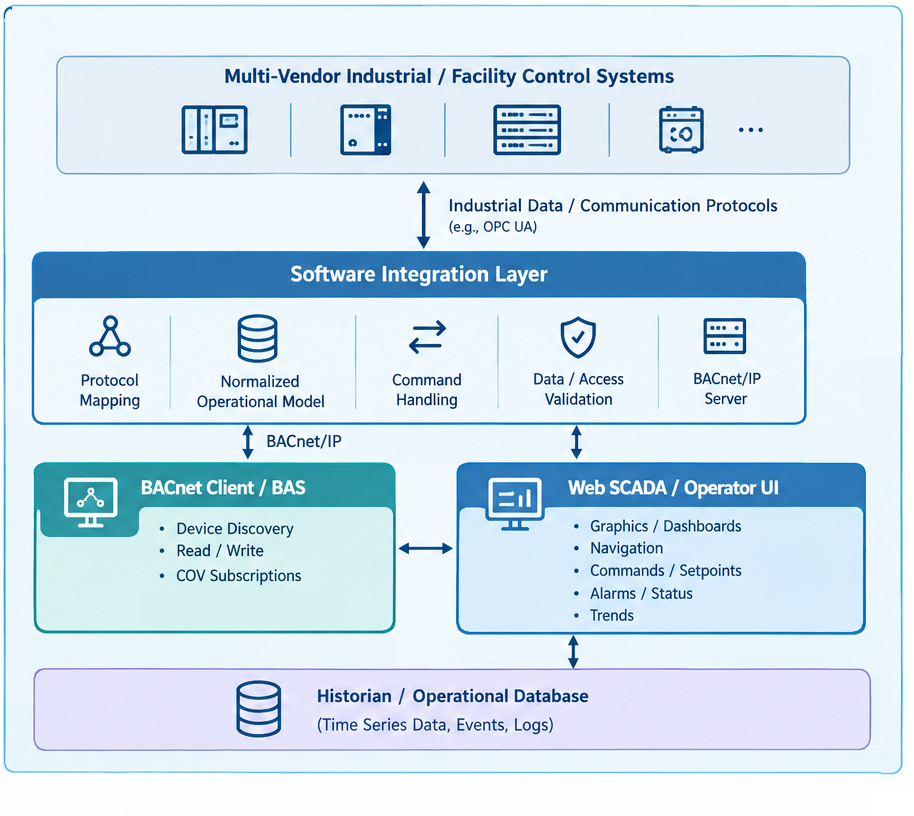
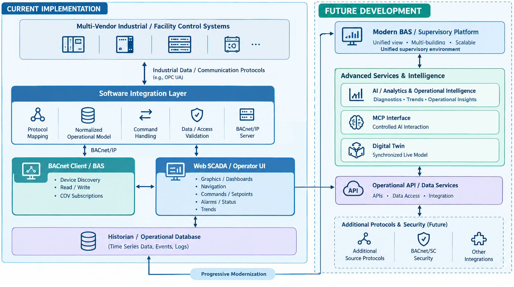

# OPC UA → BACnet/IP Software Integration Layer


A robust, software-defined Node.js gateway that bridges live CODESYS PLC data into standard BACnet/IP networks. This gateway maps complex industrial process variables into normalized, standards-compliant building automation objects without requiring native BACnet support on the PLC side, dedicated protocol hardware, or licensing fees.

Developed and validated against a physical multi-vendor industrial water-management and irrigation testbed (Zone 03 parameters).

## Why This Exists

Most industrial and facility landscapes keep operational technology (OT) and building automation services (BAS) siloed on separate communication networks. While platforms like Ignition or SCADA engines handle the industrial layer beautifully, this project serves as a hardware-validated, low-level proof of concept (`node-bacnet` to `node-opcua`) demonstrating that a lightweight software layer can safely act as a protocol boundary while preserving the underlying deterministic control.

## System Architecture & Data Flow
# Current Implementation Architecture
```text
       [ Multi-Vendor Industrial OT Layer ]
     CODESYS PLC (Zone 03 Irrigation Logic)
                        │
                        │ OPC UA (opc.tcp://127.0.0.1:4840)
                        ▼
            [ src/opcua-client.js Engine ]
        Browses namespace, polls tags every 1s
                        │
                        │ Internal In-Memory Sync Loop
                        ▼
            [ src/bacnet-device.js Server ]
      Instantiates Native BACnet Object Profiles
           │                                 │
           │ UDP Port 47808                  │ Relational Logging
           ▼                                 ▼
   [ Any BACnet Client ]          [ PostgreSQL Historian ]
(YABE, Chipkin, Niagara BAS)     Time-series Operation Logging
```

### Exposed BACnet Object Mapping

Industrial variables from the CODESYS `GVL_SCADA` space are mapped into native building management objects:

| Object Name | BACnet Profile Type | Access Permissions | Engineering & Process Context |
| :--- | :--- | :--- | :--- |
| `Zone3_Flow` | Analog Input (`AI`) | Read-Only Mirror | Live sensor flow monitoring (GPM) |
| `Zone3_Moisture` | Analog Input (`AI`) | Read-Only Mirror | Soil moisture volumetric percentage |
| `Zone3_Valve` | Binary Value (`BV`) | Read-Only Mirror | Physical irrigation valve feedback state |
| `Zone3_Fault` | Binary Value (`BV`) | Read-Only Mirror | Safety loop interlock alarm status |
| `Zone3_Auto` | Binary Output (`BO`) | **Read / Write** | Selection Switch: Auto (1) / Manual (0) |

---

## Verified Capabilities

*   **Network Device Discovery:** Responds accurately to BACnet network `Who-Is` broadcasts with compliant `I-Am` frames, matching physical device communication traits perfectly.
*   **Bidirectional Write Control Loop:** Writing a `WriteProperty` request to `Zone3_Auto` routes data lines immediately through the back-end OPC UA bridge. Real downstream physical control loop behavior has been verified (actuating the valve drives corresponding flow and moisture points up over time).
*   **Protocol Exception Handling:** To protect the deterministic PLC logic from invalid external overrides, all read-only sensor profiles intercept external commands at the data-validation block. Instead of dropping traffic or failing silently, the server returns an explicit BACnet `Write-Access-Denied` error frame.
*   **Spec-Compliant COV Subscriptions:** Supports event-driven `UnconfirmedCOVNotification` and `ConfirmedCOVNotification` paths. Clients can subscribe directly to objects to eliminate redundant polling traffic; the gateway manages subscriber tables and delivers push updates instantly upon data state mutations.
*   **Relational Historian Collection:** Logs all incoming data points, variable state changes, and controller command sequences directly to an accompanying PostgreSQL instances schema for historical trend audits.

---

## The Engineering Challenge: Debugging an Undocumented Library

Building a simple client is straightforward, but transforming a Node application into a fully compliant BACnet *server* device required navigating a runtime library stack (`node-bacnet`) explicitly tagged as **"Beta: untested, undocumented, breaking interface"** for server functionalities. 

Resolving these integration gaps required deep source-code audits rather than relying on standard documentation maps:
*   **Event Target Isolation:** Discovered that standard generic router handlers like `request` did not exist. By tracing internal source maps down through `_processServiceRequest` into `confirmedServiceMap`, the actual active event listeners were successfully exposed as explicit `readProperty` and `writeProperty` emitters.
*   **Object Architecture Constraints:** Payload models for downstream mutations are deeply nested under variant object configurations (`value.property.priority` shapes). Parsing structures flat caused immediate internal memory runtime exceptions during early test runs. The payload extraction was resolved by mapping the module's absolute decoder return values line by line.
*   **Network Socket Allocation bugs:** Intermittent connection drops and mapping collisions during dual setups with monitoring packages (YABE and Chipkin running locally) were isolated by spinning up target VMs in segregated NAT configurations. This decoupled runtime addresses and eliminated local interface port sharing contentions.
*   **COV Notification Address Extraction:** During COV subscription tracking, the library expected standard flat IP destination string arrays (`IP:Port`). However, incoming metadata objects passed complete complex network data dictionaries. Passing these raw structures directly triggered fatal pointer runtime crashes (`TypeError: receiver.split is not a function`). This required intercepting the incoming transaction envelope and extracting the raw address properties string before routing to the notification task chain.

---

## Stack & Core Dependencies

*   **Runtime:** Node.js
*   **OT Communications:** `node-opcua-client`
*   **Building Network Engine:** `node-bacnet`
*   **Database Client:** `pg` (PostgreSQL Client)
*   **Target Simulation Hardware:** CODESYS Control Win V3 x64 (Local Host)

---

## Setup & Running the Gateway

### 1. Prerequisites
Ensure your CODESYS task models are running, variables are bound inside your symbol configurations, and your local OPC UA server is actively listening on `127.0.0.1:4840`.

### 2. Installation
Clone the repository and install the production package trees:
```bash
npm install
```

### 3. Environment Allocation
Copy the environment template file and update your server variables, port bindings, and database login paths:
```bash
cp .env.example .env
```

### 4. Run the Stack
Launch your primary gateway engine:
```bash
node src/bacnet-device.js
```
# Current vs. Future Implementation Architecture


